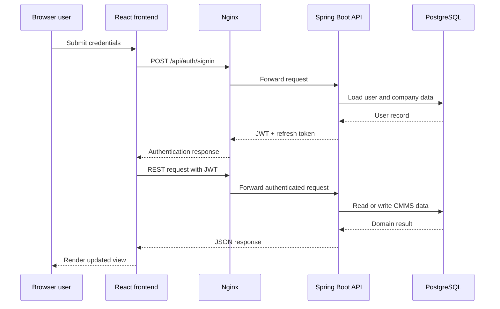
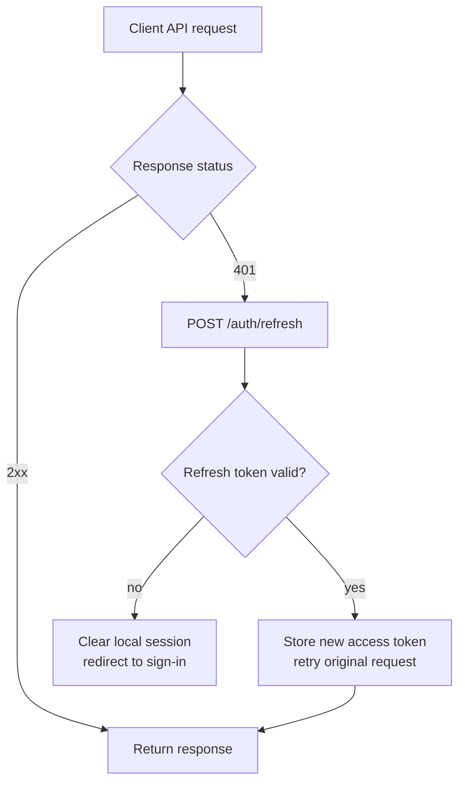
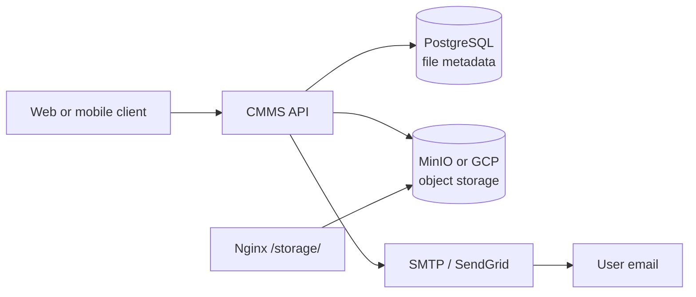

# Atlas CMMS System Architecture

This document describes the architecture currently implemented in the repository. It focuses on runtime boundaries, component interactions, data movement, design rationale, and operational constraints. The companion interactive diagram is defined in [`architecture-diagram.json`](./architecture-diagram.json) and can be rendered as `architecture-diagram.html` with Archify.

## 1. High-level overview

Atlas CMMS is a multi-client maintenance-management system with one Spring Boot API at its center:

- **Web frontend** (`frontend/`) — a React SPA used by browser users.
- **Mobile app** (`mobile/`) — an Expo/React Native client for Android and iOS.
- **Home site** (`home/`) — a separate Next.js marketing and product site.
- **API** (`api/`) — a Spring Boot service exposing REST controllers for authentication, work orders, assets, locations, inventory, files, subscriptions, analytics, webhooks, and related CMMS capabilities.
- **Data services** — PostgreSQL for business data, Liquibase for schema changes, and Quartz with JDBC persistence for scheduled jobs.
- **Ingress and storage** — Nginx provides the public entry point; object storage is configurable as MinIO or Google Cloud Storage.
- **External integrations** — SMTP/SendGrid, optional OAuth/SSO and LDAP authentication, subscription/licensing services, and Sentry/health monitoring.

The normal self-hosted topology is containerized with Docker Compose. Nginx publishes the public port and routes browser assets, `/api/` requests, and `/storage/` requests to internal services.

```mermaid
flowchart LR
    User[Users<br/>Browser / Mobile] -->|HTTP(S)| Nginx[Nginx<br/>single public ingress]
    Nginx -->|web assets| Web[React web frontend]
    Nginx -->|/api/| API[Spring Boot CMMS API]
    Nginx -->|/storage/| Storage[MinIO or GCP storage]
    Web -->|REST + JWT| API
    Mobile[Expo mobile app] -->|REST + JWT| API
    API -->|JPA / SQL| DB[(PostgreSQL)]
    API -->|scheduled work| Jobs[(Quartz JDBC jobs)]
```

## 2. Component interactions

### Clients and API

The web and mobile clients communicate with the API over REST. Both clients attach JWT access tokens and retry expired requests through the refresh-token endpoint:

1. A client calls an API controller such as `/auth/signin` or a CMMS resource endpoint.
2. The API authenticates the request through the Spring Security filter chain.
3. The controller delegates domain work to the service/repository layers.
4. JPA persists or reads business data from PostgreSQL.
5. The API returns JSON to the client.
6. A `401` response triggers client-side refresh logic before the original request is retried.

Relevant implementation points include `frontend/src/utils/api.ts`, `mobile/utils/api.ts`, `api/src/main/java/com/grash/configuration/WebSecurityConfig.java`, `api/src/main/java/com/grash/controller/AuthController.java`, and representative feature controllers such as `WorkOrderController.java`.

### Authentication and authorization

The API is configured for stateless security. Password authentication uses a DAO provider; JWT and refresh tokens maintain client sessions without server-side HTTP sessions. Optional OAuth2/SSO and LDAP providers extend the authentication boundary when enabled by configuration or licensing. Public routes are explicitly whitelisted for authentication, health, documentation, request portals, webhooks, and selected public resource endpoints.

The browser stores tokens in `localStorage`; the mobile app stores tokens and company context in `AsyncStorage`. This makes token persistence a client responsibility and allows the API to remain horizontally simple, but it increases the importance of client storage protection and refresh-token handling.

### Persistence, files, and scheduled work

- PostgreSQL is the system of record for CMMS entities and application state.
- Liquibase applies database migrations; Hibernate/JPA validates and maps the relational model.
- Quartz uses JDBC persistence for scheduled tasks such as recurring or automated work.
- The API performs file operations against MinIO or Google Cloud Storage.
- Nginx exposes the storage path under `/storage/`, while the API remains responsible for application-level file metadata and authorization.
- Email templates under `api/src/main/resources/templates/` support notifications for work orders, requests, comments, approvals, subscriptions, and account events.

### Home site and deployment surfaces

The home site is intentionally separate from the authenticated product frontend. It uses Next.js and has its own runtime configuration for the API and main application URLs. This keeps public marketing and product application concerns independently deployable.

## 3. Data flow diagrams

### Browser authentication and API request flow



### Token refresh flow



### File and notification flow



### Public and asynchronous paths

Unauthenticated request portals and webhook endpoints are admitted by the security configuration and handled by dedicated controllers. Scheduled work is persisted through Quartz’s JDBC job store and executes inside the API runtime rather than through a separately documented worker service.

## 4. Design decisions and rationale

| Decision | Rationale and evidence |
| --- | --- |
| Stateless JWT plus refresh-token authentication | Keeps the API independent of server-side HTTP sessions and supports the browser and mobile clients consistently. See `WebSecurityConfig.java` and the client API utilities. |
| Single Nginx public ingress | Provides one public host and route surface for frontend assets, API calls, and storage access. This simplifies self-hosted TLS and deployment. See `nginx.conf` and `docker-compose.yml`. |
| Separate web, home, and mobile applications | Allows the public marketing surface, authenticated browser product, and native client to evolve and deploy independently while sharing the API contract. |
| PostgreSQL plus Liquibase | Provides a durable relational system of record with versioned schema changes and JPA mappings. See `api/pom.xml` and `application.yml`. |
| Configurable object storage | Supports self-hosted MinIO and managed GCP storage without changing the API’s file-facing behavior. |
| Runtime-configured URLs and feature flags | Enables self-hosted deployments, custom mobile servers, branding, cloud licensing, SSO, and subscription capabilities without rebuilding every client. |
| Quartz with JDBC persistence | Keeps scheduled work durable across API restarts and ties job state to the primary relational deployment. |

## 5. System constraints and limitations

1. **PostgreSQL is the operational database.** The repository’s production configuration and persistence model assume PostgreSQL; local alternatives are not represented as a supported deployment architecture.
2. **Clients own token persistence.** Browser tokens are stored in `localStorage` and mobile tokens in `AsyncStorage`. Compromise of the client storage context can expose the session.
3. **Mobile selects one API base URL at a time.** The app supports a configured or user-entered custom server URL, but it does not provide built-in multi-server tenancy in one active session.
4. **Optional integrations require configuration and credentials.** OAuth/SSO, LDAP, billing, storage providers, mail, and Sentry are capability switches rather than guaranteed dependencies in every deployment.
5. **Scheduled work runs with the API deployment.** Quartz is configured inside the backend and persists jobs in PostgreSQL; independent worker scaling is not established by the repository topology.
6. **Swagger UI is disabled in the runtime configuration.** OpenAPI dependencies and API documentation assets exist, but interactive API exploration is not enabled by default.
7. **Public routes require careful security review.** Request portals, webhooks, health checks, and selected public resources are intentionally allowed through the security filter chain and should be protected by their own validation, authorization, and rate-limiting rules.
8. **The diagram reflects repository evidence, not a production SLA.** The repository describes a deployable topology and integrations, but does not establish availability targets, backup guarantees, capacity limits, or disaster-recovery objectives.

## Repository evidence

- `docker-compose.yml`
- `nginx.conf`
- `api/pom.xml`
- `api/src/main/resources/application.yml`
- `api/src/main/java/com/grash/ApiApplication.java`
- `api/src/main/java/com/grash/configuration/WebSecurityConfig.java`
- `api/src/main/java/com/grash/controller/AuthController.java`
- `api/src/main/java/com/grash/controller/WorkOrderController.java`
- `frontend/src/config.ts`
- `frontend/src/utils/api.ts`
- `mobile/config.ts`
- `mobile/utils/api.ts`
- `home/src/config.ts`
