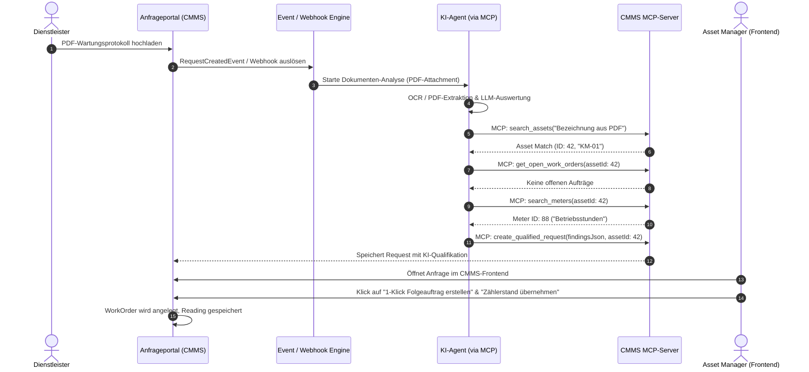

# Konzept: KI-gestützte Verarbeitung von Instandhaltungsdokumenten via MCP-Server & Anfrageportal

**Stand**: September 2026  
**Status**: Konzept / Entwurf  
**Bezug zu bestehenden Konzepten**: [`docs/ki-meldungs-triage.md`](file:///c:/Users/lars2/Dropbox/Apps/antigrav_dev/cmms4fm/docs/ki-meldungs-triage.md), [`docs/workflow-engine-konzept.md`](file:///c:/Users/lars2/Dropbox/Apps/antigrav_dev/cmms4fm/docs/workflow-engine-konzept.md)

---

## 1. Ausgangslage & Problemstellung

Im Facility Management (FM) beauftragen Asset Manager externe Dienstleister und Instandhalter mit Prüfungen, Wartungen und Reparaturen. Das Nachbereiten der Rückmeldungen verursacht im Betriebsalltag erheblichen manuellen Aufwand:

- **Dokumentenflut per E-Mail & Upload**: Instandhalter senden Wartungsprotokolle, DGUV V3 Prüfberichte, Brandschutz-Mängellisten oder Zählerlisten als unstrukturierte PDF-Dateien oder Scans.
- **Aufwendige Zuordnung**: Der Asset Manager muss jedes Protokoll manuell lesen und prüfen:
  - Zu welcher konkreten Anlage (z. B. *KM-01* vs. *KM-02*) gehört das Protokoll?
  - Was ist das Ergebnis? (*Alles OK* vs. *Mangel/Störung* vs. *Gefahrenpunkt*)?
  - Müssen Zählerstände oder Messwerte im CMMS aktualisiert werden?
  - Muss ein Folgeauftrag (Reparatur/Entstörung) ausgelöst werden?
- **Medienbruch & Verzögerung**: Mängel bleiben oft tagelang in E-Mail-Postfächern liegen, bevor ein Folgeauftrag im CMMS angelegt wird.

---

## 2. Anforderungsanalyse

### 2.1 Funktionale Anforderungen (FA)

| ID | Anforderung | Beschreibung |
|---|---|---|
| **FA-1** | **Lizenzfreier Ingest** | Externe Dienstleister müssen Dokumente ohne vollwertiges CMMS-Benutzerkonto hochladen können (via Anfrageportal `/requests/portal/...` oder E-Mail-Ingest). |
| **FA-2** | **Multimodale KI-Analyse** | PDFs, gescannte Protokolle und Tabellen müssen per OCR & LLM automatisch auf Typ, Anlagenreferenz, Status, Messwerte und Mängel analysiert werden. |
| **FA-3** | **Iterative Kontextrecherche** | Die KI muss eigenständig im CMMS nach passenden Anlagen, Standorten, Zählern und bereits offenen Aufträgen recherchieren können (Duplikatsprüfung). |
| **FA-4** | **Vorstrukturierte Befund-Erstellung** | Das System generiert aus dem Protokoll eine qualifizierte Anfrage mit verknüpfter Anlage, Zählerständen und Folgeaktionen. |
| **FA-5** | **Human-in-the-Loop (1-Klick)** | Der Asset Manager entscheidet mit einem Klick (*"Folgeauftrag auslösen"*, *"Zählerstand übernehmen"*, *"Wartung als OK bestätigen"*). Keine vollautomatische, unkontrollierte Ausführung. |

### 2.2 Nicht-Funktionale Anforderungen (NFA)

| ID | Anforderung | Beschreibung |
|---|---|---|
| **NFA-1** | **Haftungs- & Rechtssicherheit** | KI-Ergebnisse sind stets *Vorschläge*. Gesetzlich relevante Prüfberichte (z.B. BetrSichV, Brandschutz) dürfen nur von berechtigten Personen freigegeben werden. |
| **NFA-2** | **Architektonische Entkopplung** | Die KI-Logik wird über das **Model Context Protocol (MCP)** entkoppelt. Das CMMS stellt saubere Werkzeuge (Tools) bereit; die Wahl des LLMs/Agenten ist flexibel. |
| **NFA-3** | **Non-blocking Process** | Die Analyse erfolgt asynchron im Hintergrund, damit der Upload-Prozess für den Dienstleister nicht verzögert wird. |

---

## 3. Lösungsansatz: Agentische KI mit MCP-Server

Statt einer starren, festcodierten Pipeline (z. B. feste Regex-Suche) setzt dieser Ansatz auf einen **agentischen Workflow via MCP (Model Context Protocol)**.

### Warum MCP?
Ein MCP-Server macht das CMMS zu einem **"AI-Native CMMS"**. Das Sprachmodell erhält gezielte Werkzeuge (Tools), mit denen es im CMMS wie ein menschlicher Sachbearbeiter recherchieren kann:

```
[ PDF Upload im Anfrageportal ]
               │
               ▼
   [ KI-Agent (z.B. in n8n / Python) ]
               │
               ├──> 1. Liest PDF-Text & Tabellen
               ├──> 2. Ruft MCP-Tool: search_assets("Kältemaschine OG1")
               ├──> 3. Ruft MCP-Tool: get_open_work_orders(assetId=42)  (Duplikats-Check)
               ├──> 4. Ruft MCP-Tool: search_meters(assetId=42)
               └──> 5. Ruft MCP-Tool: create_qualified_request(...)
               │
               ▼
[ Bereitstellung im CMMS Frontend zur 1-Klick-Freigabe ]
```

---

## 4. Spezifikation der MCP-Tools für `cmms4fm`

Das CMMS stellt über den MCP-Server folgende Schnittstellen (Tools) bereit:

### 1. `search_assets`
* **Zweck**: Sucht Anlagen anhand von Freitext, Bezeichner, Seriennummer, Standort oder Barcode.
* **Parameter**: `query` (String), `locationId` (Optional Long), `limit` (Optional Integer).
* **Rückgabe**: Liste passender Anlagen mit `id`, `name`, `code`, `locationName`, `serialNumber`.

### 2. `get_asset_details`
* **Zweck**: Ruft detaillierte Stammdaten, Kategorie, Zähler und Wartungshistorie einer Anlage ab.
* **Parameter**: `assetId` (Long).
* **Rückgabe**: Vollständiges Anlagenobjekt inkl. benutzerdefinierter Felder und zugewiesenem Dienstleister.

### 3. `get_open_work_orders`
* **Zweck**: Prüft, ob für eine Anlage bereits offene Aufträge oder Störmeldungen existieren (Vermeidung von Doppelbeauftragungen).
* **Parameter**: `assetId` (Long).
* **Rückgabe**: Liste offener WorkOrders mit Status, Priorität und Erstellungsdatum.

### 4. `search_meters`
* **Zweck**: Ermittelt zu einer Anlage oder einem Standort vorhandene Zähler (z.B. Strom, Wasser, Betriebsstunden).
* **Parameter**: `assetId` (Optional Long), `query` (Optional String).
* **Rückgabe**: Liste passender `Meter`-Entitäten mit `id`, `name`, `unit`, `lastReading`.

### 5. `create_qualified_request`
* **Zweck**: Erstellt eine vorqualifizierte Anfrage im CMMS mit allen von der KI extrahierten Befunden.
* **Parameter**: 
  * `title` (String)
  * `description` (String, inkl. strukturierter KI-Zusammenfassung)
  * `assetId` (Optional Long)
  * `priority` (Enum: `LOW`, `MEDIUM`, `HIGH`, `NONE`)
  * `findingsJson` (String / JSON, enthält extrahierte Mängel & Zählerstände)
  * `fileId` (Long, ID des hochgeladenen PDFs)

### 6. `add_meter_reading`
* **Zweck**: Erfasst einen gemessenen Zählerstand zu einem Zähler (im Entwurfs- / Freigabemodus).
* **Parameter**: `meterId` (Long), `value` (Double), `date` (String / ISO-8601).

### 7. `create_work_order_draft`
* **Zweck**: Bereitet einen Folgeauftrag (Reparatur/Entstörung) als Entwurf vor.
* **Parameter**: `title` (String), `description` (String), `assetId` (Long), `priority` (String).

---

## 5. End-to-End Prozessablauf



---

## 6. Frontend-Integration (Human-in-the-Loop)

In der Detailansicht von Anfragen ([`frontend/src/content/own/Requests/RequestDetails.tsx`](file:///c:/Users/lars2/Dropbox/Apps/antigrav_dev/cmms4fm/frontend/src/content/own/Requests/RequestDetails.tsx)) wird das Analyseergebnis analog zur bestehenden [`QualificationCard.tsx`](file:///c:/Users/lars2/Dropbox/Apps/antigrav_dev/cmms4fm/frontend/src/content/own/Requests/QualificationCard.tsx) visualisiert:

- **PDF-Vorschau (Split-Screen)**: Links wird das hochgeladene Protokoll aus MinIO gerendert.
- **Analyse-Karte (Rechts)**:
  - 🟢 **Status**: *Wartung durchgeführt – 1 Mangel festgestellt*.
  - 📍 **Zugeordnete Anlage**: *Kältemaschine KM-01 (94% Übereinstimmung)* `[Ändern]`.
  - 📊 **Extrahierte Zählerwerte**: *Betriebsstunden: 4.120 h* `[Zählerstand übernehmen]`.
  - ⚠️ **Festgestellter Mangel**: *Dichtung an Ventil V-2 undicht*.
  - 🚀 **Empfohlene Aktion**: `[Folge-Arbeitsauftrag erstellen]` (Öffnet Modal mit vorausgefüllten Daten).

---

## 7. Umsetzungsstrategie (Stufenplan)

### Phase 1: Schnell-Pilotierung mit n8n & Node.js MCP-Wrapper (1–2 Tage)
1. **MCP-Wrapper**: Erstellen eines schlanken Standalone MCP-Servers in TypeScript/Node.js oder Python, der die vorhandenen `cmms4fm` REST-Endpunkte (`/api/assets/search`, `/api/requests`, etc.) via API-Key anbindet.
2. **n8n Workflow**: Erstellen eines n8n-Workflows mit LLM-Node (Gemini/OpenAI), der das PDF liest, über den MCP-Server recherchiert und Anfragen in `cmms4fm` befüllt.
3. **Erster Test**: Durchrechnen von 5–10 realen Wartungsberichten.

### Phase 2: Frontend-Anpassung in `cmms4fm` (1 Woche)
1. Erstellen von `DocumentAnalysisCard.tsx` im React-Frontend.
2. Anbindung der 1-Klick-Aktionen (`apply-reading`, `create-work-order-from-finding`).

### Phase 3: Nativer Spring Boot MCP Server (Optional / Langfristig)
1. Integration von `spring-ai-mcp-boot-starter` direkt im `api/`-Backend von `cmms4fm`.
2. Direkte Bereitstellung der MCP-Tools über SSE/HTTP-Schnittstellen des CMMS.

---

## 8. Abgrenzung & Verweise im Repository

- **[`docs/ki-meldungs-triage.md`](file:///c:/Users/lars2/Dropbox/Apps/antigrav_dev/cmms4fm/docs/ki-meldungs-triage.md)**: Beschreibt Stufe 1 der rein textuellen Lexical-Triage für Anfragen. Das vorliegende Konzept erweitert diese Triage um multimodale Dokumentenverarbeitung & MCP-Tools.
- **[`CLAUDE.md`](file:///c:/Users/lars2/Dropbox/Apps/antigrav_dev/cmms4fm/CLAUDE.md)**: Dokumentiert das REST-API-Gating und die Aktivierung von API-Keys über `SELF_HOSTED_UNLOCK_PREMIUM=true`.
